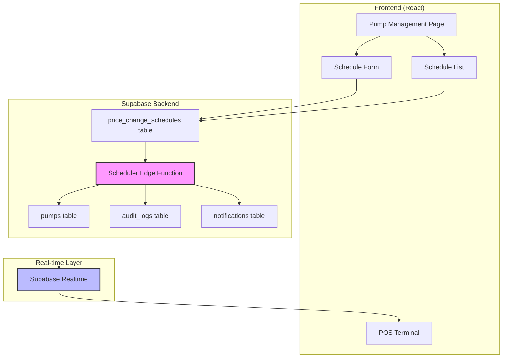

# Design Document: Scheduled Price Changes

## Overview

The Scheduled Price Changes feature enables administrators to schedule future fuel price changes that execute automatically at specified times. The system consists of three main components:

1. **Admin UI** - React components for creating, viewing, editing, and canceling price change schedules
2. **Database Layer** - Tables and functions for storing schedules, tracking execution, and maintaining audit trails
3. **Scheduler Service** - Background process that monitors pending schedules and executes price changes at the scheduled time

The system integrates with existing Supabase infrastructure for real-time updates, ensuring that POS terminals immediately reflect new prices when changes execute. All operations are fully audited, and the scheduler includes robust error handling and recovery mechanisms.

### Key Design Decisions

- **Polling-based scheduler**: Use Supabase Edge Functions with scheduled invocations (cron) rather than a separate Node.js process, leveraging Supabase's built-in scheduling capabilities
- **Atomic bulk updates**: All pumps in a schedule update together or not at all, using database transactions
- **Real-time propagation**: Leverage existing Supabase realtime subscriptions in POS to automatically refresh prices
- **Immutable audit trail**: All schedule operations (create, edit, cancel, execute) are logged with full before/after state
- **Soft conflict detection**: Warn admins about potential conflicts but allow overlapping schedules (business decision)

## Architecture

### System Components



### Data Flow

**Schedule Creation Flow:**
1. Admin fills schedule form in Pump Management page
2. Frontend validates inputs (future datetime, positive prices)
3. Frontend calls Supabase to insert `price_change_schedules` record
4. Database trigger creates audit log entry
5. Frontend refreshes schedule list

**Schedule Execution Flow:**
1. Scheduler Edge Function runs every 60 seconds (Supabase cron)
2. Query `price_change_schedules` for pending records where `scheduled_at <= now()`
3. For each due schedule:
   - Begin database transaction
   - Update `price_per_liter` for all pumps in `pump_ids` array
   - Update schedule status to 'executed' with `executed_at` timestamp
   - Create audit log entry
   - Create notification for admins
   - Commit transaction
4. Supabase realtime broadcasts pump updates
5. POS terminals receive realtime events and refresh prices

**Error Recovery Flow:**
1. If execution fails, rollback transaction
2. Update schedule status to 'failed' with error details
3. Create high-priority notification for admins
4. Log error to audit trail
5. Continue processing other schedules

## Components and Interfaces

### Frontend Components

#### SchedulePriceChangeForm
**Location:** `src/components/SchedulePriceChangeForm.jsx`

**Props:**
- `branchId: UUID` - Current branch context
- `pumps: Array<Pump>` - Available pumps for selection
- `onSuccess: () => void` - Callback after successful schedule creation
- `onCancel: () => void` - Callback to close form
- `editingSchedule?: PriceChangeSchedule` - Optional schedule to edit

**State:**
- `scheduledDate: string` - Target date (YYYY-MM-DD)
- `scheduledTime: string` - Target time (HH:MM)
- `pumpSelectionMode: 'individual' | 'all' | 'by-fuel-type'`
- `selectedPumpIds: Array<UUID>`
- `priceChanges: Map<UUID, number>` - Pump ID → new price
- `notes: string`
- `conflicts: Array<PriceChangeSchedule>` - Detected conflicts

**Methods:**
- `validateDateTime()` - Ensure scheduled time is at least 1 minute in future
- `validatePrices()` - Ensure all prices are positive with max 2 decimals
- `checkConflicts()` - Query for overlapping schedules within ±10 minutes
- `handleSubmit()` - Create or update schedule record

#### ScheduleList
**Location:** `src/components/ScheduleList.jsx`

**Props:**
- `branchId: UUID` - Current branch context
- `onEdit: (schedule) => void` - Callback to open edit form
- `onRefresh: () => void` - Callback after schedule changes

**State:**
- `schedules: Array<PriceChangeSchedule>`
- `statusFilter: 'all' | 'pending' | 'executed' | 'cancelled' | 'failed'`
- `branchFilter: UUID | 'all'`

**Methods:**
- `fetchSchedules()` - Load schedules with filters
- `handleCancel(scheduleId)` - Cancel a pending schedule
- `calculateCountdown(scheduledAt)` - Compute time until execution
- `subscribeToUpdates()` - Listen for realtime schedule changes

### Backend Components

#### Database Tables

**price_change_schedules**
```sql
CREATE TABLE price_change_schedules (
  id UUID PRIMARY KEY DEFAULT uuid_generate_v4(),
  
  -- Scheduling info
  scheduled_at TIMESTAMPTZ NOT NULL,
  created_at TIMESTAMPTZ NOT NULL DEFAULT now(),
  updated_at TIMESTAMPTZ NOT NULL DEFAULT now(),
  
  -- Execution tracking
  status TEXT NOT NULL DEFAULT 'pending' 
    CHECK (status IN ('pending', 'executed', 'cancelled', 'failed')),
  executed_at TIMESTAMPTZ,
  cancelled_at TIMESTAMPTZ,
  error_message TEXT,
  
  -- Target pumps and prices
  branch_id UUID REFERENCES branches(id) ON DELETE CASCADE,
  pump_ids UUID[] NOT NULL, -- Array of pump IDs to update
  price_changes JSONB NOT NULL, -- { "pump_id": new_price, ... }
  
  -- Metadata
  created_by UUID REFERENCES auth.users(id),
  created_by_name TEXT,
  cancelled_by UUID REFERENCES auth.users(id),
  cancelled_by_name TEXT,
  notes TEXT,
  
  -- Constraints
  CONSTRAINT future_schedule CHECK (scheduled_at > created_at),
  CONSTRAINT valid_pump_ids CHECK (array_length(pump_ids, 1) > 0)
);

CREATE INDEX idx_schedules_status ON price_change_schedules(status);
CREATE INDEX idx_schedules_scheduled_at ON price_change_schedules(scheduled_at);
CREATE INDEX idx_schedules_branch ON price_change_schedules(branch_id);
```

**notifications**
```sql
CREATE TABLE notifications (
  id UUID PRIMARY KEY DEFAULT uuid_generate_v4(),
  
  -- Target user (NULL = all admins)
  user_id UUID REFERENCES auth.users(id),
  
  -- Notification content
  type TEXT NOT NULL CHECK (type IN ('info', 'warning', 'error', 'success')),
  title TEXT NOT NULL,
  message TEXT NOT NULL,
  
  -- Related entity
  entity_type TEXT, -- 'price_change_schedule'
  entity_id UUID,
  
  -- Status
  is_read BOOLEAN NOT NULL DEFAULT false,
  read_at TIMESTAMPTZ,
  
  -- Timestamps
  created_at TIMESTAMPTZ NOT NULL DEFAULT now(),
  expires_at TIMESTAMPTZ NOT NULL DEFAULT (now() + INTERVAL '30 days')
);

CREATE INDEX idx_notifications_user ON notifications(user_id);
CREATE INDEX idx_notifications_unread ON notifications(is_read) WHERE is_read = false;
CREATE INDEX idx_notifications_created ON notifications(created_at DESC);
```

#### Database Functions

**execute_price_change_schedule**
```sql
CREATE OR REPLACE FUNCTION execute_price_change_schedule(
  p_schedule_id UUID
) RETURNS JSONB AS $$
DECLARE
  v_schedule RECORD;
  v_pump_id UUID;
  v_new_price NUMERIC;
  v_old_prices JSONB := '{}';
  v_updated_count INT := 0;
BEGIN
  -- Get schedule details
  SELECT * INTO v_schedule
  FROM price_change_schedules
  WHERE id = p_schedule_id
    AND status = 'pending'
  FOR UPDATE; -- Lock row
  
  IF NOT FOUND THEN
    RETURN jsonb_build_object(
      'success', false,
      'error', 'Schedule not found or already processed'
    );
  END IF;
  
  -- Update each pump
  FOR v_pump_id IN SELECT unnest(v_schedule.pump_ids)
  LOOP
    -- Get new price from price_changes JSONB
    v_new_price := (v_schedule.price_changes->>v_pump_id::text)::NUMERIC;
    
    -- Store old price for audit
    SELECT jsonb_build_object(
      v_pump_id::text,
      price_per_liter
    ) INTO v_old_prices
    FROM pumps
    WHERE id = v_pump_id;
    
    -- Update pump price
    UPDATE pumps
    SET price_per_liter = v_new_price,
        updated_at = now()
    WHERE id = v_pump_id;
    
    v_updated_count := v_updated_count + 1;
  END LOOP;
  
  -- Mark schedule as executed
  UPDATE price_change_schedules
  SET status = 'executed',
      executed_at = now(),
      updated_at = now()
  WHERE id = p_schedule_id;
  
  -- Create audit log
  PERFORM log_audit(
    'execute',
    'price_change_schedule',
    p_schedule_id,
    format('Executed price change for %s pumps', v_updated_count),
    v_old_prices,
    v_schedule.price_changes,
    jsonb_build_object(
      'scheduled_at', v_schedule.scheduled_at,
      'executed_at', now(),
      'pump_count', v_updated_count
    ),
    v_schedule.branch_id,
    NULL, -- branch_name (can be joined if needed)
    NULL, -- cashier_id
    NULL  -- cashier_name
  );
  
  -- Create success notification
  INSERT INTO notifications (type, title, message, entity_type, entity_id)
  VALUES (
    'success',
    'Price Change Executed',
    format('Scheduled price change for %s pumps executed successfully', v_updated_count),
    'price_change_schedule',
    p_schedule_id
  );
  
  RETURN jsonb_build_object(
    'success', true,
    'pumps_updated', v_updated_count,
    'executed_at', now()
  );
  
EXCEPTION WHEN OTHERS THEN
  -- Mark schedule as failed
  UPDATE price_change_schedules
  SET status = 'failed',
      error_message = SQLERRM,
      updated_at = now()
  WHERE id = p_schedule_id;
  
  -- Create error notification
  INSERT INTO notifications (type, title, message, entity_type, entity_id)
  VALUES (
    'error',
    'Price Change Failed',
    format('Failed to execute price change: %s', SQLERRM),
    'price_change_schedule',
    p_schedule_id
  );
  
  -- Log error
  PERFORM log_audit(
    'error',
    'price_change_schedule',
    p_schedule_id,
    format('Failed to execute price change: %s', SQLERRM),
    NULL,
    NULL,
    jsonb_build_object('error', SQLERRM),
    v_schedule.branch_id,
    NULL,
    NULL,
    NULL
  );
  
  RETURN jsonb_build_object(
    'success', false,
    'error', SQLERRM
  );
END;
$$ LANGUAGE plpgsql SECURITY DEFINER;
```

**check_schedule_conflicts**
```sql
CREATE OR REPLACE FUNCTION check_schedule_conflicts(
  p_scheduled_at TIMESTAMPTZ,
  p_pump_ids UUID[],
  p_exclude_schedule_id UUID DEFAULT NULL
) RETURNS TABLE (
  schedule_id UUID,
  scheduled_at TIMESTAMPTZ,
  pump_ids UUID[],
  created_by_name TEXT,
  time_diff_minutes INT
) AS $$
BEGIN
  RETURN QUERY
  SELECT 
    s.id,
    s.scheduled_at,
    s.pump_ids,
    s.created_by_name,
    EXTRACT(EPOCH FROM (s.scheduled_at - p_scheduled_at))::INT / 60 AS time_diff_minutes
  FROM price_change_schedules s
  WHERE s.status = 'pending'
    AND s.id != COALESCE(p_exclude_schedule_id, '00000000-0000-0000-0000-000000000000'::UUID)
    AND s.pump_ids && p_pump_ids -- Array overlap operator
    AND ABS(EXTRACT(EPOCH FROM (s.scheduled_at - p_scheduled_at))) <= 600 -- Within 10 minutes
  ORDER BY s.scheduled_at;
END;
$$ LANGUAGE plpgsql;
```

#### Scheduler Edge Function

**Location:** `supabase/functions/price-change-scheduler/index.ts`

```typescript
import { serve } from 'https://deno.land/std@0.168.0/http/server.ts'
import { createClient } from 'https://esm.sh/@supabase/supabase-js@2'

serve(async (req) => {
  try {
    const supabase = createClient(
      Deno.env.get('SUPABASE_URL') ?? '',
      Deno.env.get('SUPABASE_SERVICE_ROLE_KEY') ?? ''
    )
    
    // Find all pending schedules that are due
    const { data: dueSchedules, error: fetchError } = await supabase
      .from('price_change_schedules')
      .select('id, scheduled_at, pump_ids')
      .eq('status', 'pending')
      .lte('scheduled_at', new Date().toISOString())
      .order('scheduled_at', { ascending: true })
    
    if (fetchError) throw fetchError
    
    const results = []
    
    // Execute each schedule
    for (const schedule of dueSchedules || []) {
      const { data, error } = await supabase.rpc(
        'execute_price_change_schedule',
        { p_schedule_id: schedule.id }
      )
      
      results.push({
        schedule_id: schedule.id,
        success: data?.success || false,
        error: error?.message || data?.error
      })
    }
    
    return new Response(
      JSON.stringify({
        success: true,
        processed: results.length,
        results
      }),
      { headers: { 'Content-Type': 'application/json' } }
    )
    
  } catch (error) {
    return new Response(
      JSON.stringify({ success: false, error: error.message }),
      { status: 500, headers: { 'Content-Type': 'application/json' } }
    )
  }
})
```

**Cron Configuration:** `supabase/functions/price-change-scheduler/cron.yml`
```yaml
- name: "price-change-scheduler"
  schedule: "* * * * *" # Every minute
  function: "price-change-scheduler"
```

### API Interfaces

#### Create Schedule
```typescript
// POST /rest/v1/price_change_schedules
interface CreateScheduleRequest {
  scheduled_at: string // ISO 8601 timestamp
  branch_id: string
  pump_ids: string[]
  price_changes: Record<string, number> // { pump_id: new_price }
  notes?: string
}

interface CreateScheduleResponse {
  id: string
  status: 'pending'
  scheduled_at: string
  created_at: string
  conflicts?: Array<{
    schedule_id: string
    scheduled_at: string
    time_diff_minutes: number
  }>
}
```

#### Update Schedule
```typescript
// PATCH /rest/v1/price_change_schedules?id=eq.{schedule_id}
interface UpdateScheduleRequest {
  scheduled_at?: string
  pump_ids?: string[]
  price_changes?: Record<string, number>
  notes?: string
}
```

#### Cancel Schedule
```typescript
// PATCH /rest/v1/price_change_schedules?id=eq.{schedule_id}
interface CancelScheduleRequest {
  status: 'cancelled'
  cancelled_at: string
  cancelled_by: string
  cancelled_by_name: string
}
```

#### List Schedules
```typescript
// GET /rest/v1/price_change_schedules?status=eq.pending&order=scheduled_at.asc
interface ListSchedulesResponse {
  schedules: Array<{
    id: string
    scheduled_at: string
    status: 'pending' | 'executed' | 'cancelled' | 'failed'
    branch_id: string
    pump_ids: string[]
    price_changes: Record<string, number>
    created_by_name: string
    created_at: string
    executed_at?: string
    cancelled_at?: string
    error_message?: string
  }>
}
```

## Data Models

### PriceChangeSchedule
```typescript
interface PriceChangeSchedule {
  id: string
  scheduled_at: string // ISO 8601
  created_at: string
  updated_at: string
  
  status: 'pending' | 'executed' | 'cancelled' | 'failed'
  executed_at?: string
  cancelled_at?: string
  error_message?: string
  
  branch_id: string
  pump_ids: string[]
  price_changes: Record<string, number> // { pump_id: new_price }
  
  created_by: string
  created_by_name: string
  cancelled_by?: string
  cancelled_by_name?: string
  notes?: string
}
```

### Notification
```typescript
interface Notification {
  id: string
  user_id?: string // null = all admins
  
  type: 'info' | 'warning' | 'error' | 'success'
  title: string
  message: string
  
  entity_type?: string
  entity_id?: string
  
  is_read: boolean
  read_at?: string
  
  created_at: string
  expires_at: string
}
```

### Pump (Extended)
```typescript
interface Pump {
  id: string
  branch_id: string
  pump_number: number
  pump_name: string
  fuel_type: string
  price_per_liter: number // Updated by scheduler
  tank_id?: string
  is_active: boolean
  notes?: string
  created_at: string
  updated_at: string // Updated when price changes
}
```

## Correctness Properties

*A property is a characteristic or behavior that should hold true across all valid executions of a system—essentially, a formal statement about what the system should do. Properties serve as the bridge between human-readable specifications and machine-verifiable correctness guarantees.*

### Property 1: Schedule Creation Validity

*For any* valid schedule input (future datetime, positive prices with max 2 decimals, non-empty pump list), creating a schedule SHALL result in a database record with status 'pending' and an audit log entry.

**Validates: Requirements 1.3, 1.4, 1.5, 1.7, 1.8**

### Property 2: Schedule Execution Atomicity

*For any* pending schedule where current time >= scheduled time, executing the schedule SHALL either update ALL specified pumps' prices and mark status as 'executed' with timestamp and audit entry, OR update NO pumps and mark status as 'failed' with error details.

**Validates: Requirements 2.3, 2.4, 2.5, 2.6, 2.7, 12.6, 12.7**

### Property 3: Price Propagation Correctness

*For any* sale recorded after a price change execution, the sale SHALL use the new price_per_liter value, and any sales recorded before the price change SHALL remain unchanged with their original prices.

**Validates: Requirements 3.4, 3.5**

### Property 4: Edit Validation Consistency

*For any* schedule edit where the new scheduled time is less than 5 minutes in the future, the system SHALL reject the edit, and for any edit where the new scheduled time is >= 5 minutes in the future, the system SHALL accept the edit and create an audit log entry.

**Validates: Requirements 5.3, 5.6, 5.5**

### Property 5: Cancellation Validity

*For any* pending schedule where current time is more than 1 minute before scheduled time, cancellation SHALL succeed and update status to 'cancelled' with timestamp and audit entry, and for any schedule within 1 minute of execution, cancellation SHALL be rejected.

**Validates: Requirements 6.3, 6.4, 6.5, 6.6**

### Property 6: Branch Isolation

*For any* price change schedule targeting specific branches, execution SHALL only update pumps belonging to those branches, and pumps in other branches SHALL remain unchanged.

**Validates: Requirements 7.3, 7.4**

### Property 7: Conflict Detection Accuracy

*For any* pair of schedules targeting overlapping pump sets, if their scheduled times are within 10 minutes of each other, the system SHALL detect and report the conflict, and if their scheduled times are more than 10 minutes apart, no conflict SHALL be reported.

**Validates: Requirements 8.1, 8.2, 8.4**

### Property 8: Audit Completeness

*For any* schedule operation (create, edit, cancel, execute, fail), the system SHALL create an audit log entry containing the operation type, timestamp, user identity, old values (for updates), and new values.

**Validates: Requirements 9.1, 9.2, 9.6**

## Error Handling

### Validation Errors

**Client-Side Validation:**
- Scheduled datetime must be at least 1 minute in the future
- All prices must be positive numbers with max 2 decimal places
- At least one pump must be selected
- Display inline error messages with specific field feedback

**Server-Side Validation:**
- Re-validate all client-side rules (never trust client)
- Verify pump IDs exist and belong to specified branch
- Verify user has admin permissions
- Return 400 Bad Request with detailed error messages

### Execution Errors

**Database Transaction Failures:**
- Rollback all pump price updates
- Mark schedule status as 'failed'
- Store error message in `error_message` field
- Create high-priority notification for all admins
- Log full error details to audit trail
- Continue processing other pending schedules

**Scheduler Failures:**
- If Edge Function invocation fails, Supabase will retry automatically
- If function times out, next invocation will pick up missed schedules
- Missed schedules (scheduled_at in past, status still 'pending') execute immediately
- Log warning in audit trail about delayed execution

### Concurrency Errors

**Duplicate Execution Prevention:**
- Use `FOR UPDATE` lock when fetching pending schedules
- Only process schedules with status = 'pending'
- Status transition to 'executed' prevents re-execution

**Conflicting Edits:**
- Use optimistic locking with `updated_at` timestamp
- If edit conflicts with another update, return 409 Conflict
- Prompt user to refresh and retry

### Real-time Subscription Errors

**POS Connection Loss:**
- POS displays offline indicator (existing functionality)
- On reconnection, POS refetches all pump prices from database
- Ensures POS always has current prices even after network interruption

**Subscription Failure:**
- If realtime subscription fails, POS falls back to polling every 30 seconds
- Display warning banner: "Real-time updates unavailable, prices may be delayed"

## Testing Strategy

### Unit Tests

**Schedule Validation:**
- Test datetime validation with various past/future times
- Test price validation with valid/invalid values
- Test pump selection validation

**Conflict Detection:**
- Test conflict detection with overlapping/non-overlapping schedules
- Test time window boundaries (exactly 10 minutes apart)

**UI Components:**
- Test form rendering and field validation
- Test schedule list filtering and sorting
- Test countdown timer calculations

### Property-Based Tests

**Property Test Configuration:**
- Minimum 100 iterations per property test
- Use fast-check library for TypeScript/JavaScript
- Tag each test with format: `Feature: scheduled-price-changes, Property {number}: {property_text}`

**Property 1: Schedule Creation Validity**
```typescript
// Feature: scheduled-price-changes, Property 1: Schedule Creation Validity
// For any valid schedule input, creating a schedule SHALL result in a database record with status 'pending' and an audit log entry
```

**Property 2: Schedule Execution Atomicity**
```typescript
// Feature: scheduled-price-changes, Property 2: Schedule Execution Atomicity
// For any pending schedule, execution SHALL update ALL pumps or NO pumps atomically
```

**Property 3: Price Propagation Correctness**
```typescript
// Feature: scheduled-price-changes, Property 3: Price Propagation Correctness
// For any sale after price change, sale SHALL use new price; sales before SHALL use old price
```

**Property 4: Edit Validation Consistency**
```typescript
// Feature: scheduled-price-changes, Property 4: Edit Validation Consistency
// For any edit, validation SHALL reject if <5 min to execution, accept otherwise
```

**Property 5: Cancellation Validity**
```typescript
// Feature: scheduled-price-changes, Property 5: Cancellation Validity
// For any cancellation, SHALL succeed if >1 min before execution, reject otherwise
```

**Property 6: Branch Isolation**
```typescript
// Feature: scheduled-price-changes, Property 6: Branch Isolation
// For any schedule, execution SHALL only affect pumps in target branches
```

**Property 7: Conflict Detection Accuracy**
```typescript
// Feature: scheduled-price-changes, Property 7: Conflict Detection Accuracy
// For any schedule pair, conflict SHALL be detected if within 10 min and overlapping pumps
```

**Property 8: Audit Completeness**
```typescript
// Feature: scheduled-price-changes, Property 8: Audit Completeness
// For any operation, audit log SHALL contain operation type, timestamp, user, and values
```

### Integration Tests

**Scheduler Execution:**
- Test Edge Function invocation with mocked schedules
- Test execution of multiple schedules in sequence
- Test error handling and recovery
- Test missed schedule detection and immediate execution

**Real-time Updates:**
- Test Supabase realtime broadcast when pump prices update
- Test POS subscription receives and processes updates
- Test reconnection and price refresh after network interruption

**Database Transactions:**
- Test atomic bulk updates with intentional failures
- Test rollback behavior
- Test concurrent schedule execution attempts

### End-to-End Tests

**Complete Schedule Lifecycle:**
1. Admin creates schedule
2. Verify schedule appears in list with countdown
3. Admin edits schedule
4. Verify audit log shows edit
5. Wait for scheduled time (or mock time)
6. Verify scheduler executes price change
7. Verify POS reflects new prices
8. Verify audit log shows execution

**Error Scenarios:**
1. Create schedule with invalid data
2. Verify validation errors display
3. Create schedule that will fail execution (e.g., invalid pump ID)
4. Verify failure notification and audit log
5. Verify other schedules continue processing

### Performance Tests

**Bulk Schedule Execution:**
- Test execution of 10+ schedules at same time
- Verify all execute within 60 seconds
- Verify no deadlocks or race conditions

**Large Pump Sets:**
- Test schedule with 50+ pumps
- Verify atomic update completes successfully
- Verify reasonable execution time (<5 seconds)

**Concurrent Admin Operations:**
- Test multiple admins creating/editing schedules simultaneously
- Verify no data corruption
- Verify all operations logged correctly

