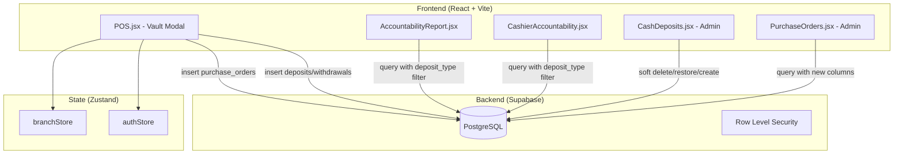

# Design Document: Vault & PO Expansion

## Overview

This feature expands the gas station POS system in three areas:

1. **Vault Deposit Classification** — The POS vault modal expands from 2 tabs (Deposit/Withdraw) to 4 options by introducing a `deposit_type` column that classifies deposits as `vault_deposit`, `gcash`, or `cash_register`. The accountability report breaks down vault activity by type.

2. **Admin Vault Management** — The admin CashDeposits page gains soft-delete with restore capability, admin-created deposits, and deposit type filtering.

3. **PO/Charge Invoice Expansion** — The PO form adds new reference fields (`ci_number`, `po_slip_number`, `description`, `unit_type`) and supports a "Product/Lubes" mode for non-fuel charge invoices. Reports display all 7 columns.

All changes are additive — new nullable columns ensure backward compatibility with existing data.

## Architecture

The feature follows the existing architecture:



**Key architectural decisions:**

1. **No new tables** — All changes are column additions to existing `cash_deposits` and `purchase_orders` tables.
2. **Soft delete via `deleted_at`** — Standard pattern; queries add `.is('deleted_at', null)` filter.
3. **Deposit type as TEXT with CHECK** — Simple enum-like constraint without a separate lookup table, matching existing patterns (e.g., `status` on `purchase_orders`).
4. **Product mode POs** — Reuses the `purchase_orders` table with `pump_id = null` and `fuel_type_id = null` to indicate non-fuel items.

## Components and Interfaces

### Database Migration (new file: `supabase/25_vault_po_expansion.sql`)

```sql
-- Add deposit_type to cash_deposits
ALTER TABLE public.cash_deposits
  ADD COLUMN IF NOT EXISTS deposit_type TEXT
  CHECK (deposit_type IN ('vault_deposit', 'gcash', 'cash_register'));

-- Add soft delete column
ALTER TABLE public.cash_deposits
  ADD COLUMN IF NOT EXISTS deleted_at TIMESTAMPTZ;

-- Index for soft delete queries
CREATE INDEX IF NOT EXISTS idx_cash_deposits_deleted_at
  ON public.cash_deposits(deleted_at);

-- Add new PO fields
ALTER TABLE public.purchase_orders
  ADD COLUMN IF NOT EXISTS ci_number TEXT,
  ADD COLUMN IF NOT EXISTS po_slip_number TEXT,
  ADD COLUMN IF NOT EXISTS description TEXT,
  ADD COLUMN IF NOT EXISTS unit_type TEXT
  CHECK (unit_type IN ('liters', 'pcs'));
```

### POS Vault Modal (modified: `src/pages/POS.jsx`)

**Current state:** 2 tabs — `deposit` and `withdraw`
**New state:** 4 tabs — `vault_deposit`, `withdraw`, `gcash`, `cash_register`

```typescript
// Tab configuration
const VAULT_TABS = [
  { key: 'vault_deposit', label: 'Vault Deposit', icon: Vault },
  { key: 'withdraw', label: 'Withdrawals/Cash Out', icon: DollarSign },
  { key: 'gcash', label: 'GCash', icon: Smartphone },
  { key: 'cash_register', label: 'Cash Register', icon: Banknote },
]

// On deposit submit, include deposit_type
const depositPayload = {
  cashier_id: cashier.id,
  branch_id: cashier.branch_id,
  amount: parseFloat(vaultAmount),
  deposit_type: vaultTab, // 'vault_deposit' | 'gcash' | 'cash_register'
  notes: vaultNotes || null,
  shift_date: currentShiftDate,
  shift_number: selectedShift,
}
```

### POS PO Form (modified: `src/pages/POS.jsx`)

**New state variables:**
```typescript
const [poMode, setPoMode] = useState('fuel') // 'fuel' | 'product'
const [poCiNumber, setPoCiNumber] = useState('')
const [poSlipNumber, setPoSlipNumber] = useState('')
const [poDescription, setPoDescription] = useState('')
const [poUnitType, setPoUnitType] = useState('liters') // 'liters' | 'pcs'
const [poProductId, setPoProductId] = useState('')
```

**Mode switching logic:**
- Fuel mode: existing pump dropdown, liters/amount calculation, unit_type = 'liters'
- Product mode: product dropdown, manual amount entry, pump_id = null, fuel_type_id = null, unit_type = 'pcs', description auto-filled from product name

### Admin CashDeposits Page (modified: `src/pages/CashDeposits.jsx`)

**New features:**
1. **Type column** — Shows deposit_type with fallback to "Vault Deposit" for null
2. **Type filter** — Dropdown to filter by deposit_type
3. **Soft delete** — `handleDelete` sets `deleted_at` instead of deleting
4. **Show deleted toggle** — Checkbox to include soft-deleted records
5. **Restore button** — Sets `deleted_at = null` on soft-deleted records
6. **Create Deposit form** — Modal with cashier select, branch, amount, type, date, notes

### Admin PurchaseOrders Page (modified: `src/pages/PurchaseOrders.jsx`)

**New features:**
1. **New columns** — CI Number, PO Slip Number, Description, Unit Type in table
2. **Extended search** — Includes `ci_number` and `po_slip_number` in filter
3. **Updated print** — Customer statement includes new columns

### Accountability Report (modified: `src/pages/AccountabilityReport.jsx`)

**Vault section changes:**
- Split deposits into 3 sub-rows: Vault Deposits, GCash, Cash Register
- Keep Withdrawals as separate row
- Net Vault = sum of all 4 types

**Charge Invoice table changes:**
- 7 columns: C.I. No., P.O. Slip No., Customer, Plate Number, Description, Unit, Amount
- Null fields display as "—"
- unit_type displays as "Liters" or "Pcs"

### Cashier Accountability Modal (modified: `src/components/CashierAccountability.jsx`)

**Changes:**
- Vault breakdown by deposit_type (matching accountability report)
- Exclude soft-deleted deposits from totals

## Data Models

### cash_deposits (modified)

| Column | Type | Nullable | New | Description |
|--------|------|----------|-----|-------------|
| id | UUID | No | | Primary key |
| branch_id | UUID | Yes | | FK to branches |
| cashier_id | UUID | No | | FK to cashiers |
| amount | NUMERIC(12,2) | No | | Deposit amount |
| deposit_date | TIMESTAMPTZ | No | | When deposited |
| notes | TEXT | Yes | | Optional notes |
| deposit_type | TEXT | Yes | ✓ | vault_deposit, gcash, cash_register |
| deleted_at | TIMESTAMPTZ | Yes | ✓ | Soft delete timestamp |
| shift_date | DATE | Yes | | Shift date |
| shift_number | INTEGER | Yes | | Shift number |
| created_at | TIMESTAMPTZ | No | | Record creation |
| updated_at | TIMESTAMPTZ | No | | Last update |
| created_by | UUID | Yes | | Creator user |
| updated_by | UUID | Yes | | Last updater |

**Constraints:**
- `deposit_type CHECK (deposit_type IN ('vault_deposit', 'gcash', 'cash_register'))`
- Null `deposit_type` treated as `vault_deposit` in application logic

### purchase_orders (modified)

| Column | Type | Nullable | New | Description |
|--------|------|----------|-----|-------------|
| id | UUID | No | | Primary key |
| po_number | TEXT | Yes | | Auto-generated PO number |
| cashier_id | UUID | No | | FK to cashiers |
| customer_name | TEXT | No | | Customer name |
| pump_id | UUID | Yes | | FK to pumps (null for product mode) |
| fuel_type_id | UUID | Yes | | FK to fuel_types (null for product mode) |
| amount | NUMERIC(12,2) | No | | Total amount |
| liters | NUMERIC(10,3) | Yes | | Liters (null for product mode) |
| price_per_liter | NUMERIC(10,2) | Yes | | Price per liter |
| plate_number | TEXT | Yes | | Vehicle plate |
| notes | TEXT | Yes | | Optional notes |
| ci_number | TEXT | Yes | ✓ | Charge Invoice number |
| po_slip_number | TEXT | Yes | ✓ | PO slip reference |
| description | TEXT | Yes | ✓ | Item description |
| unit_type | TEXT | Yes | ✓ | 'liters' or 'pcs' |
| status | TEXT | No | | unpaid/partial/paid/cancelled |
| shift_date | DATE | Yes | | Shift date |
| shift_number | INTEGER | Yes | | Shift number |
| created_at | TIMESTAMPTZ | No | | Record creation |
| updated_at | TIMESTAMPTZ | No | | Last update |

**Constraints:**
- `unit_type CHECK (unit_type IN ('liters', 'pcs'))`
- Null `unit_type` is valid (backward compatibility)

### Helper Functions

```javascript
// Deposit type display helper
export function getDepositTypeLabel(depositType) {
  const labels = {
    vault_deposit: 'Vault Deposit',
    gcash: 'GCash',
    cash_register: 'Cash Register',
  }
  return labels[depositType] || 'Vault Deposit' // null defaults to Vault Deposit
}

// Unit type display helper
export function getUnitTypeLabel(unitType) {
  const labels = { liters: 'Liters', pcs: 'Pcs' }
  return labels[unitType] || '—'
}

// Group deposits by type for vault breakdown
export function groupDepositsByType(deposits) {
  const groups = { vault_deposit: 0, gcash: 0, cash_register: 0 }
  deposits.forEach(d => {
    const type = d.deposit_type || 'vault_deposit'
    groups[type] = (groups[type] || 0) + parseFloat(d.amount || 0)
  })
  return groups
}

// Filter out soft-deleted deposits
export function filterActiveDeposits(deposits) {
  return deposits.filter(d => !d.deleted_at)
}
```

## Correctness Properties

*A property is a characteristic or behavior that should hold true across all valid executions of a system — essentially, a formal statement about what the system should do. Properties serve as the bridge between human-readable specifications and machine-verifiable correctness guarantees.*

### Property 1: Null deposit_type defaults to vault_deposit

*For any* deposit record where `deposit_type` is null, the `getDepositTypeLabel` function SHALL return "Vault Deposit", and the `groupDepositsByType` function SHALL include that deposit's amount in the `vault_deposit` bucket.

**Validates: Requirements 1.3, 3.3**

### Property 2: Net Vault calculation correctness

*For any* array of active deposit records (with various `deposit_type` values) and withdrawal records, the Net Vault SHALL equal the sum of all deposit amounts (grouped by type: vault_deposit + gcash + cash_register) plus the total withdrawals amount.

**Validates: Requirements 3.2**

### Property 3: Soft-deleted deposits excluded from active queries

*For any* array of deposit records where some have non-null `deleted_at` timestamps, the `filterActiveDeposits` function SHALL return only records where `deleted_at` is null, and the count of returned records SHALL be less than or equal to the total count.

**Validates: Requirements 5.3, 5.5, 5.6**

### Property 4: Soft delete preserves record with timestamp

*For any* deposit record, after a soft-delete operation, the record SHALL still exist in the dataset with a non-null `deleted_at` timestamp, and all other fields SHALL remain unchanged.

**Validates: Requirements 5.2**

### Property 5: Restore clears deleted_at

*For any* soft-deleted deposit record (where `deleted_at` is not null), after a restore operation, the `deleted_at` field SHALL be null and the record SHALL appear in active queries.

**Validates: Requirements 6.2**

### Property 6: Deposit type filter returns only matching records

*For any* array of deposits with mixed `deposit_type` values and a selected filter type, filtering SHALL return only deposits whose `deposit_type` matches the filter (treating null as `vault_deposit`).

**Validates: Requirements 4.3**

### Property 7: Product mode PO nullifies fuel fields

*For any* PO created in "Product/Lubes" mode, the resulting record SHALL have `pump_id` equal to null and `fuel_type_id` equal to null.

**Validates: Requirements 9.5**

### Property 8: Product selection auto-fills description and unit_type

*For any* product selected from the products table in "Product/Lubes" mode, the PO form SHALL set `description` to the product's name and `unit_type` to "pcs".

**Validates: Requirements 9.4**

### Property 9: Null PO fields display as dash

*For any* purchase order record where `ci_number`, `po_slip_number`, `description`, or `unit_type` is null, the display function SHALL render "—" for each null field.

**Validates: Requirements 10.2**

### Property 10: Unit type display mapping

*For any* purchase order with `unit_type` equal to "liters" or "pcs", the `getUnitTypeLabel` function SHALL return "Liters" or "Pcs" respectively. For null `unit_type`, it SHALL return "—".

**Validates: Requirements 10.3**

### Property 11: Search includes ci_number and po_slip_number

*For any* purchase order with a non-null `ci_number` or `po_slip_number`, searching by that exact value SHALL include the purchase order in the filtered results.

**Validates: Requirements 11.2**

## Error Handling

| Scenario | Handling |
|----------|----------|
| Migration fails | Transaction rollback — no partial changes. Existing data untouched. |
| Null deposit_type in UI | Default to "Vault Deposit" label. Never crash on null. |
| Null PO fields in report | Display "—" for each null field. |
| Soft-deleted deposit in calculations | Excluded by `.is('deleted_at', null)` filter on all queries. |
| Product mode PO with no amount | Form validation prevents submission. Toast error shown. |
| Network failure during deposit/PO creation | Existing pattern: toast error, no partial state change. |
| Invalid deposit_type value | CHECK constraint rejects at database level. Supabase returns error, caught by try/catch. |
| Invalid unit_type value | CHECK constraint rejects at database level. Form only offers valid options. |
| Admin creates deposit for non-existent cashier | FK constraint on cashier_id prevents insertion. Error shown. |

## Testing Strategy

### Property-Based Tests (Vitest + fast-check)

The project already uses `vitest` and `fast-check`. Property tests will validate the helper functions and data transformation logic.

**Configuration:**
- Minimum 100 iterations per property test
- Each test tagged with: `Feature: vault-po-expansion, Property {number}: {title}`
- Test file: `src/__tests__/vault-po-expansion.property.test.js`

**Properties to implement:**
1. `getDepositTypeLabel` null handling (Property 1)
2. `groupDepositsByType` + net vault calculation (Property 2)
3. `filterActiveDeposits` exclusion (Property 3)
4. Soft delete preserves data (Property 4)
5. Restore clears deleted_at (Property 5)
6. Deposit type filtering (Property 6)
7. Product mode null fields (Property 7)
8. Product auto-fill (Property 8)
9. Null PO field display (Property 9)
10. Unit type label mapping (Property 10)
11. Search filter inclusion (Property 11)

### Unit Tests (Example-Based)

- Vault modal renders 4 tabs
- Each tab submits correct deposit_type
- PO form shows new fields
- PO form mode switching (fuel ↔ product)
- Admin create deposit form validation
- Restore button appears for soft-deleted records
- Print output includes all 7 CI columns

### Integration Tests

- Database migration runs without error on existing data
- Existing deposits (null deposit_type) still query correctly
- Existing POs (null new fields) still display correctly
- All branches function after migration

### Migration Safety

- Migration wrapped in transaction (standard Supabase behavior)
- All new columns are nullable — no DEFAULT that could lock large tables
- No existing column modifications
- Indexes added with `IF NOT EXISTS` for idempotency
